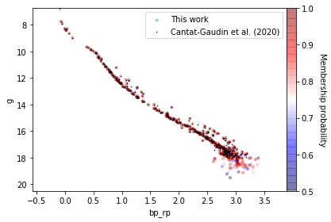

# Cluster Membership Analysis
Stellar clusters are groups of stars formed together, at the same time, and from the same material. Stars that are members of the same cluster share a similar spatial location and kinematics compared to all the other stars. 

I use billions of data provided by the [Gaia spacecraft](https://www.cosmos.esa.int/web/gaia/the-mission) and Machine Learning algorithms to identify members of stellar clusters.

As an example, members of the open cluster Blanco 1 are identified by the analysis in [membership_analysis.ipynb](membership_analysis.ipynb).
Members of the cluster are aligned in the color-magnitude diagram below. Symbols are color coded as a function of probability of membership.

